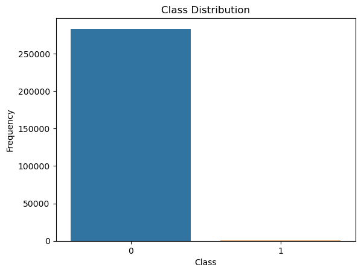
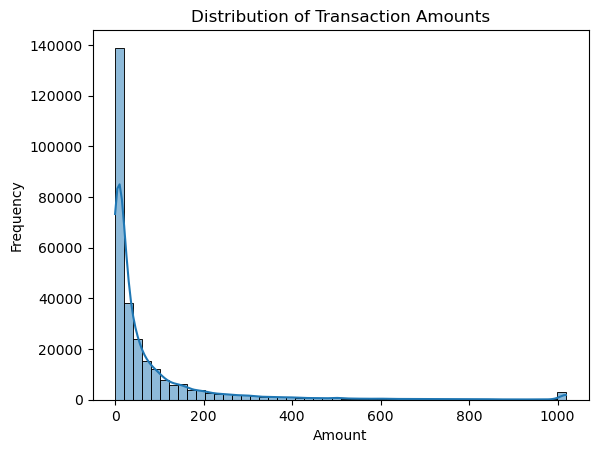
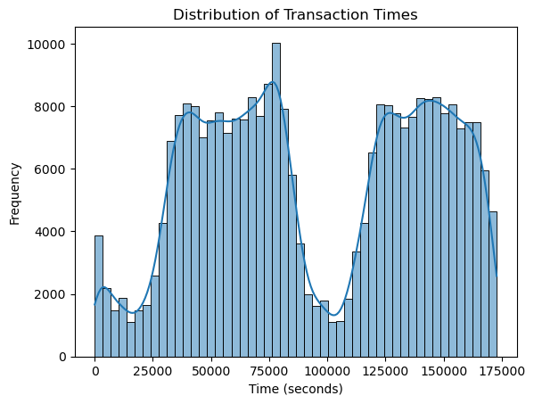
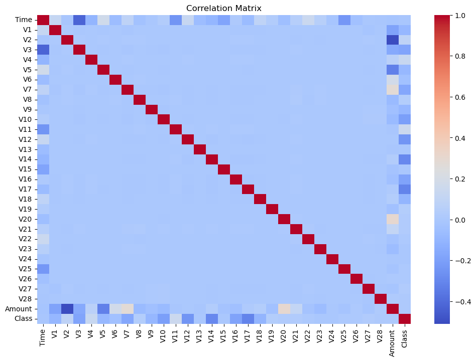

# Credit Card Fraud Detection Analysis

## Overview
This project focuses on analyzing a dataset of credit card transactions to detect fraudulent activities. The dataset contains anonymized credit card transactions made by European cardholders in September 2013. The goal of this analysis is to build predictive models that can accurately identify fraudulent transactions and understand the underlying patterns in the data.

## Dataset
The dataset used in this project is the [Credit Card Fraud Detection](https://www.kaggle.com/datasets/mlg-ulb/creditcardfraud) dataset from Kaggle. It contains the following key columns:
- `Time`: Number of seconds elapsed between each transaction and the first transaction in the dataset.
- `V1-V28`: Anonymized features resulting from a PCA transformation (due to confidentiality issues, the original features are not provided).
- `Amount`: Transaction amount.
- `Class`: Target variable indicating whether the transaction is fraudulent (1) or not (0).

## Problem Description
The goal of this analysis is to detect fraudulent credit card transactions using machine learning models. Specifically, we aim to:
1. Explore the dataset to understand the distribution of fraudulent and non-fraudulent transactions.
2. Preprocess the data by handling missing values, outliers, and normalizing features.
3. Build and evaluate machine learning models to predict fraudulent transactions.
4. Address the class imbalance problem using techniques like SMOTE (Synthetic Minority Over-sampling Technique).

## Notebook Overview
The Jupyter Notebook includes the following sections:

### 1. Data Loading
- The dataset is loaded using `pandas` from the `creditcard.csv` file.

### 2. Data Cleaning
- Check for missing values and duplicates.
- Handle outliers in the `Amount` column by clipping values above the 99th percentile.
- Remove irrelevant features (if any).

### 3. Exploratory Data Analysis (EDA)
- Class distribution of fraudulent vs. non-fraudulent transactions.
- Distribution of transaction amounts and times.
- Correlation matrix to show relationships between numerical variables.

### 4. Data Preprocessing
- Normalize the `Amount` and `Time` columns using `StandardScaler`.
- Split the data into training and testing sets.

### 5. Model Building and Evaluation
- Logistic Regression: Train a logistic regression model and evaluate its performance using classification report, confusion matrix, and ROC AUC score.
- Random Forest: Train a random forest model with reduced trees and parallel processing, and evaluate its performance.
- SMOTE: Apply SMOTE to handle class imbalance and retrain the models.

### 6. Results and Comparison
- Compare the performance of logistic regression and random forest models with and without SMOTE.

## Key Insights
### 1. Class Distribution
- The dataset is highly imbalanced, with only 0.17% of transactions being fraudulent.
- This imbalance poses a challenge for model training, as models may tend to predict the majority class.

### 2. Transaction Amount Distribution
- Most transactions are of low value, with a few high-value outliers.
- After clipping, the distribution of transaction amounts becomes more focused on typical values.

### 3. Model Performance
- Logistic Regression: Achieves a precision of 0.86 and recall of 0.59 for fraudulent transactions without SMOTE. With SMOTE, recall improves to 0.87, but precision drops to 0.05.
- Random Forest: Achieves a precision of 0.96 and recall of 0.67 without SMOTE. With SMOTE, recall improves to 0.74, and precision remains high at 0.90.

### 4. SMOTE Impact
- SMOTE significantly improves the recall of both models, indicating better detection of fraudulent transactions.
- However, it also leads to a decrease in precision for logistic regression, suggesting more false positives.

## Visualizations
Here are some key visualizations from the analysis:
1. Class Distribution:
   
2. Transaction Amount Distribution:
   
3. Transaction Time Distribution:
   
4. Correlation Matrix:
   

## Modeling
### Logistic Regression
- A logistic regression model was built to predict fraudulent transactions.
- The model achieved a ROC AUC score of 0.79 without SMOTE and 0.92 with SMOTE.

### Random Forest
- A random forest model was built with reduced trees and parallel processing.
- The model achieved a ROC AUC score of 0.84 without SMOTE and 0.87 with SMOTE.

## Conclusion
This analysis provides valuable insights into detecting fraudulent credit card transactions. The visualizations highlight the class imbalance and distribution of transaction amounts and times. The models, especially random forest with SMOTE, show promising results in detecting fraudulent transactions.

## Future Work
- Explore additional techniques to handle class imbalance, such as undersampling or ensemble methods.
- Experiment with more advanced models like Gradient Boosting or Neural Networks.
- Analyze the impact of different feature engineering techniques on model performance.

## Dependencies
The project requires the following Python libraries:
- `pandas`
- `numpy`
- `matplotlib`
- `seaborn`
- `scikit-learn`
- `imblearn`
- `jupyter`

These can be installed using the `requirements.txt` file:
```bash
pip install -r requirements.txt
```

## Acknowledgments
- Dataset: [Credit Card Fraud Detection](https://www.kaggle.com/datasets/mlg-ulb/creditcardfraud) from Kaggle.
- Libraries: `pandas`, `numpy`, `matplotlib`, `seaborn`, `scikit-learn`, `imblearn`.
